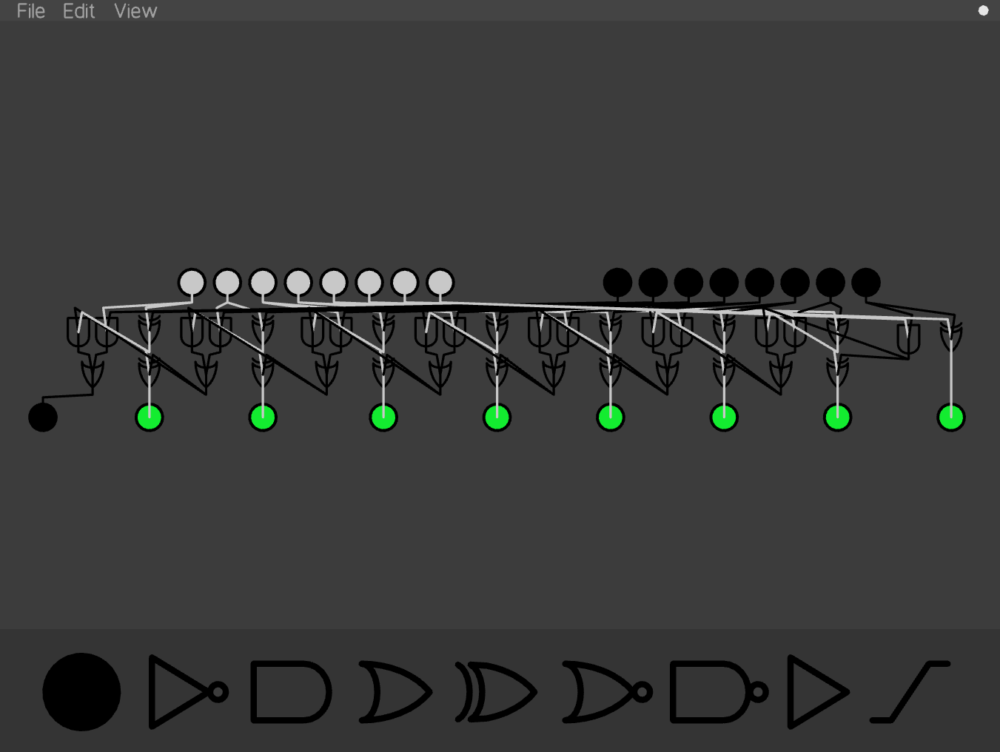

# Logic Gates




### Compile (windows 64 bit):
```
> gcc logicgates.c -L./Windows -lglfw3 -lopengl32 -lgdi32 -lglad -lole32 -luuid -DOS_WINDOWS -o logicgates.exe
```
Then run logicgates.exe\
I've also included the 64-bit binary (logicgates.exe) for convenience,\
so you can just run that without compilation if you're on windows (and on a 64 bit machine)

### Compile (linux):
```
$ gcc logicgates.c -L./Linux -lglfw3 -ldl -lm -lX11 -lglad -lGL -lGLU -lpthread -DOS_LINUX -o logicgates.o
```
Then run ./logicgates.o

To load a file, type:\
logicgates.exe {filename.txt}\
in the terminal (with no brackets)\
I've included some demo projects in the "Demos" folder\
Files can also be loaded in via the GUI menu

This application is designed to be usable with just a mouse, but there are\
keybind shortcuts to make building circuits faster.

## Keybinds:
* click and drag - Place components, move components, or move screen
* click on a POWER component to toggle it on/off
* scroll wheel - zoom
* space + click + drag - create wire
* 1 or e - POWER component (input/output)
* 2 or n - NOT gate
* 3 or a - AND gate
* 4, q, or o - OR gate
* 5 - XOR gate
* 6 - NOR gate
* 7 - NAND gate
* 8 - BUFFER gate
* x - delete component
* shift + click + drag - select
* shift + click - add component to selection
* c - copy/paste selected
* scroll wheel (or up and down arrows) - zoom
* up and down arrows - zoom (fine)
* space/shift + scroll wheel - rotate component (coarse)
* sideways arrows - rotate component (fine)
* space + sideways arrows - rotate selected (fine)
* k - export to file
* h - toggle sidebar
* w - toggle wireMode
* t - toggle a POWER component
* shift + t - toggle theme (dark/light)
* z - snap to grid
* p - correct wiring
* b - toggle texture mode
* ctrl + c - copy
* ctrl + x - cut
* ctrl + v - paste
* ctrl + z - undo
* ctrl + y - redo
* shift + x - delete and replace

## Debugger
Press d to toggle the debugger on/off - you should see a flash when you do this and an orange square appears in the top left when the debugger is on\
In the debugger, the following keybinds are available:
* ctrl + space - step one tick
* ctrl + scroll - step one tick (forwards or backwards)

Note that the backwards step is a simple undo. Meaning any edits you make while the debugger is running can be rolled back if you scroll back\
It is not recommended to make lots of edits in debug mode if you are using the backwards step feature. It is intended for precise viewing of tick-by-tick sequences

## Fundemental Problem
The order in which you wire components influences the number of ticks it takes for power to pass through them.\
Consider three POWER components, wired as such:\
A -> B -> C\
If the wire A -> B was created before wire B -> C, then turning A on will turn C on in the next tick.\
If the wire B -> C was created before wire A -> B, then turning A on will turn C on in the tick after the next.\
This is bad. There should not be a difference. But I don't know how to fix it.\
The obvious solution would be to order wires in memory, such that any wire that has B as an output comes BEFORE any wire that has B as an input.\
But that will break if you have A -> B and B -> A. Which one should go first? This is an unsolvable problem.\
But I want consistent behaviour, so I have to think of something to do about this.\
### Here's the proposed algorithm:
* Find the first component with no inputs
* Do Breadth first search:
  * Take all wires that have component X as an input, and order them so that X -> A, X -> B, X -> C, ...
  * Mark X as visited
  * Redefine component X as whichever component is first on the output list from X and unvisited
  * Do breadth first search again
* Repeat step 1. If all components are visited then you are done. If no components have no inputs then pick the first unvisited component as component X. Repeat until all components are visited
### Turns out that doesn't work
* Instead of Breadth first search, do Depth first search
* Implementation is a little strange. And the fact that I have to check for duplicates every time I update a wire is worrying. That shouldn't have to happen but cycles cause problems if that isn't done.
* It's not perfect either, but it is a lot better
* Press P to update your wire orders to a "standard ordering". This ordering SHOULDN'T change based on when you created the components and wires. I haven't proven that this is the case though. I suspect it is not though, which means I have more work to do.
* The "standard ordering" also attempts to minimise component delay wherever possible. Buffers in standard ordering should never take two ticks to pass a signal, though I have seen it happen, and there may be ways to force this behaviour with specific paradoxical wiring. Additionally, two-input components (AND, OR, etc) should activate instantly with no delay. This is usually the case, but it can't always be ensured.
* It is possible for, during a single tick, a component to have two different outputs. Particularly observable in the case of a NOR latch. The output of a latch is instant, but the updating of the internal state of the latch takes an extra tick. In the one tick between, the NOR gate will be outputting a set or reset to the output and the opposite to the other NOR gate. There may be something that can be done about this.
* The P key also attempts to fix any rifts between wire rendering and internal processing. Think of it like pressing Ctrl + L in gdb tui

### Personal Feature Request:
 - Make it so when you drag a wire from a powered component the wire is the powered colour (should be easy)
 - Grid mode
 - Grouped units "summonable" (without having to save and add file)
 - Multiple tabs
 - Multiple colours? (customisable?)
 
